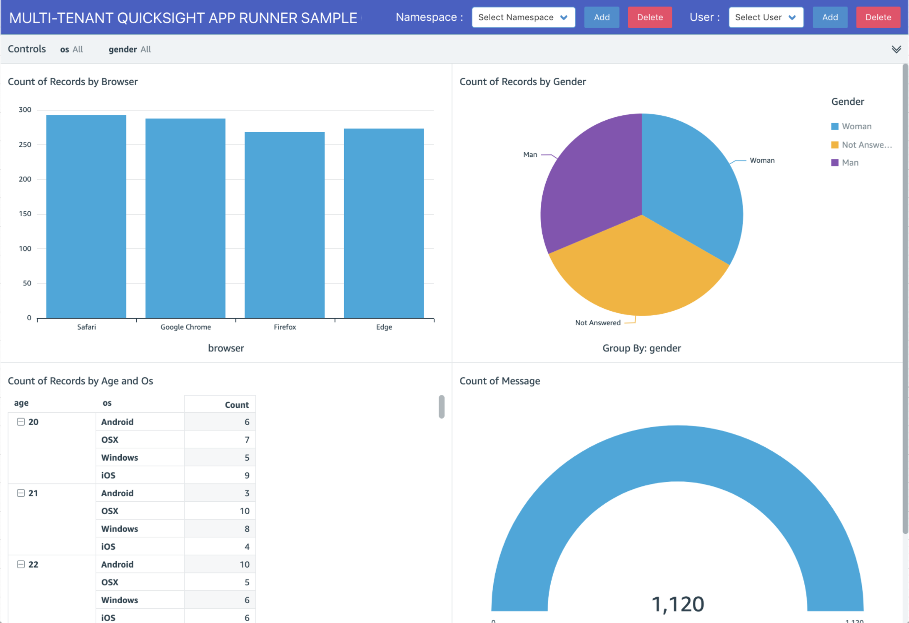

## Multi-tenant QuickSight with AWS App Runner CDK Sample



### Requirements

- [Node.js](https://nodejs.org/en/)
- [Docker](https://www.docker.com/get-started)
- [AWS Configuration and credential file settings](https://docs.aws.amazon.com/cli/latest/userguide/cli-configure-files.html)
- [AWS CLI version 2](https://docs.aws.amazon.com/cli/latest/userguide/install-cliv2.html)

Node.js のインストール後、リポジトリのルートディレクトリで `npm ci` を実行して AWS CDK をインストールしてください。

### 埋め込みダッシュボードのフロー図


### 権限範囲


### 1. QuickSight の利用開始

QuickSight の `Enterprise Edition` を開始し、データソースの接続に必要なアクセス権限を付与します。

### 2. 分析テンプレートの作成

QuickSight の `Datasets` から `New dataset` を選び、必要な情報を入力して `Analysis` の作成まで進みます。`Analysis` の作成完了後、以下のコマンドを実行して `Analysis Template` を作成します。

```bash
aws quicksight create-template \
  --aws-account-id "000000000000" \
  --template-id "sample-template" \
  --source-entity '{ "SourceAnalysis": { "Arn": "arn:aws:quicksight:us-west-1:000000000000:analysis/52fa5c2b-278b-46e0-911a-3ac65312e565", "DataSetReferences": [ { "DataSetPlaceholder": "sample-dataset", "DataSetArn": "arn:aws:quicksight:us-west-1:000000000000:dataset/c16e1126-95a0-4c38-9c76-2d3fb439d6d8" } ] } }'
```

このコマンドでは下記変数を元にテンプレートを作成しています。適宜内容を変更してください。`AnalysisId` や `DatasetId` は上述の手順で作成した `Dataset` 及び `Analysis` の ID を指定します。

| 項目                   | 値                                     |
| ---------------------- | -------------------------------------- |
| **AwsAccountId**       | `000000000000`                         |
| **Region**             | `us-west-1`                            |
| **TemplateId**         | `sample-template`                      |
| **AnalysisId**         | `52fa5c2b-278b-46e0-911a-3ac65312e565` |
| **DataSetPlaceholder** | `sample-dataset`                       |
| **DatasetId**          | `c16e1126-95a0-4c38-9c76-2d3fb439d6d8` |

### 3. 各テナント向けデータセット作成コードの修正

利用するデータソース、およびデータセットの作成方法に応じて、 `docker/controller/namespace.ts` の `createDataSet` 部分のコードを修正します。このサンプルでは、CustomSql を用いて Amazon Athena に接続し、WHERE 句でテナントを区別してデータを制限しています。必要に応じて適宜コードを変更してください。

```ts
  const createDataSet = await quicksight
    .createDataSet({
      AwsAccountId: AWS_ACCOUNT_ID,
      DataSetId: namespaceId,
      ImportMode: 'DIRECT_QUERY',
      Name: namespaceId,
      PhysicalTableMap: {
        [physicalTableMapId]: {
          CustomSql: {
            DataSourceArn: `arn:aws:quicksight:${AWS_REGION}:${AWS_ACCOUNT_ID}:datasource/${DATASOURCE_ID}`,
            Name: 'CustomQuery',
            SqlQuery: `select * from ${DATABASE_NAME}.${TABLE_NAME} where ${FILTER_COLUMN_NAME} = '${namespaceFilterId}'`
          }
        }
      },
      LogicalTableMap: {
        [logicalTableMap]: {
          Alias: 'CustomQuery',
          Source: {
            PhysicalTableId: physicalTableMapId
          }
        }
      },
      ...
```

### 4. スタックのデプロイ

`cdk.json` を編集し、以下の情報を埋めます。

| 項目                           | 値                                                                                                                   | 例                                     |
| ------------------------------ | -------------------------------------------------------------------------------------------------------------------- | -------------------------------------- |
| **allowIpRange**               | マルチテナントダッシュボードのデモサイトを閲覧できる IP の許可レンジ                                                 | `0.0.0.0/0`                            |
| **dummyEmail**                 | このサンプルでは QuickSight の閲覧者に QuickSight からメールが送信されることを防ぐためにダミーのアドレスを入力します |                                        |
| **quicksightAdminUserName**    | すべてのテナントのダッシュボードを操作可能な QuickSight の管理アカウント                                             | `admin`                                |
| **templateId**                 | 上記手順で作成した `Analysis Template` の ID                                                                         | `sample-template`                      |
| **templateDatasetPlaceholder** | 上記手順で作成したの `Dataset Placeholder`                                                                           | `sample-dataset`                       |
| **datasourceId**               | 各テナントのダッシュボードが参照するデータソースの ID                                                                | `fec40e29-c9c7-470f-ad91-322113068792` |
| **databaseName**               | 各テナントのデータセット作成に必要な要素（このサンプルでは Athena のカタログ名）                                     | `database`                             |
| **tableName**                  | 各テナントのデータセット作成に必要な要素（このサンプルでは Athena のテーブル名）                                     | `table`                                |
| **filterColumnName**           | 各テナントのデータセット作成時にテナントを区別するために用いるカラム名                                               | `tenant`                               |

指定したデータソースの設定に必要な要素である `databaseName` `tableName` `filterColumnName` は、`3.` のコードに合わせて適宜変更してください。完了後、以下のコマンドでスタックをデプロイします。

```bash
npx cdk deploy AppRunnerStack
```

### 5. UI に接続

QuickSight から埋め込みの許可設定を行います。AWS Console から QuickSight に接続して、
`Manage QuickSight` から `Domains and Embedding` を選びます。表示されるフォームに `AppRunnerStack` をデプロイした後表示される URL を入力し、追加してください。

> Outputs:
> AppRunnerStack.AppRunnerStackapprunneruri = https://example.region.awsapprunner.com

完了後、ブラウザから追加した URL アクセスします。

UI では認証を省き、テナントの追加・削除、およびテナントに所属するユーザーの追加・削除の操作が自由に行えます。プロダクション環境では任意の認証機能を組み込み、接続しているテナントに応じて自動的にダッシュボードを出し分けてください。

## Security

See [CONTRIBUTING](CONTRIBUTING.md#security-issue-notifications) for more information.

## License

This library is licensed under the MIT-0 License. See the LICENSE file.
